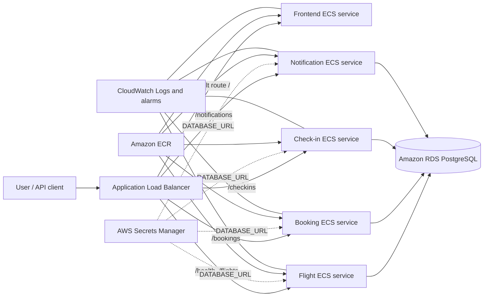

# UnitedOps: ECS DevOps Platform

UnitedOps is an airline operations application used to demonstrate an end-to-end AWS DevOps workflow. A Next.js frontend and four TypeScript APIs are containerized with Docker, stored in Amazon ECR, and run as independent services on Amazon ECS Fargate. Terraform provisions the infrastructure, GitHub Actions automates validation and deployment, and CloudWatch provides logs, metrics, alarms, and scaling signals.

The application code is intentionally small. The project focuses on the operational path from a source-code change to a monitored workload running in AWS.

## Architecture



GitHub Actions builds Linux AMD64 images, pushes them to ECR, and requests rolling ECS deployments. Terraform state is encrypted in S3 and protected from concurrent modification with DynamoDB locking.

## What Was Built

| Area | Implementation | Why it matters |
| --- | --- | --- |
| Containers | Docker images for the frontend and four APIs | Creates the same deployable unit for local and cloud environments |
| Registry | Separate ECR repository per application | Stores versioned images near the ECS runtime |
| Compute | Five ECS services on serverless Fargate tasks | Runs containers without managing EC2 worker nodes |
| Traffic | Public ALB with path-based target groups and health checks | Provides one entry point and routes requests to healthy services |
| Data | PostgreSQL on Amazon RDS | Moves database maintenance, backups, and availability concerns to a managed service |
| Secrets | `DATABASE_URL` in Secrets Manager, injected at task startup | Keeps credentials out of images, source code, and task definitions |
| Infrastructure | Terraform for networking, ECS, ALB, RDS, IAM, monitoring, and scaling | Makes the environment repeatable and reviewable |
| State | Encrypted S3 backend with DynamoDB locking | Enables shared state and prevents concurrent Terraform writes |
| Delivery | GitHub Actions for validation, plans, manual applies, and service deployments | Adds repeatable checks and controlled automation |
| Operations | CloudWatch log groups, CPU/memory alarms, ALB/RDS alarms, and ECS target tracking | Supports troubleshooting, alerting, and capacity changes |

## Request Flow

1. A client sends a request to the ALB DNS name; `/` uses the default frontend target group.
2. API paths match higher-priority listener rules and select their backend target groups.
3. The target group forwards the request only to healthy Fargate task IPs.
4. ECS maintains the desired task count and replaces failed tasks.
5. The task receives `DATABASE_URL` from Secrets Manager and queries RDS.
6. Container output is sent to CloudWatch Logs; metrics drive alarms and autoscaling.

## Repository Layout

```text
apps/
  frontend/                  Next.js dashboard
  flight-service/            Flight status API
  booking-service/           Reservation API
  checkin-service/           Passenger check-in API
  notification-service/      Notification API
infra/
  db/                        PostgreSQL initialization
  terraform/dev/             AWS infrastructure as code
.github/workflows/           CI/CD and Terraform workflows
docs/                        Phase notes and interview guide
docker-compose.yml           Complete local environment
```

## Run Locally

Requirements: Docker Desktop with Docker Compose.

```bash
docker compose up --build
docker compose ps
```

Validate the APIs:

```bash
curl http://localhost:4001/health
curl http://localhost:4002/health
curl http://localhost:4003/health
curl http://localhost:4004/health
```

Open the frontend at `http://localhost:3000`. Stop the environment with `docker compose down`; add `-v` only when the local PostgreSQL data should also be deleted.

## Deploy to AWS

1. Create the five ECR repositories and push Linux AMD64 images.
2. Copy the example Terraform files and replace placeholders locally:

```bash
cd infra/terraform/dev
cp terraform.tfvars.example terraform.tfvars
cp backend.hcl.example backend.hcl
```

3. Initialize the remote backend and review the proposed changes:

```bash
terraform init -backend-config=backend.hcl
terraform fmt -check -recursive
terraform validate
terraform plan
terraform apply
```

The S3 state bucket and DynamoDB lock table must exist before backend initialization. Local variable files, backend configuration, state, credentials, and secrets are excluded from Git.

Validate the deployed platform:

```bash
BASE_URL=$(terraform output -raw flight_service_url)
curl "$BASE_URL/health"
curl "$BASE_URL/flights"
curl "$BASE_URL/bookings"
```

## CI/CD Workflows

- **Terraform Validate:** checks formatting and Terraform configuration without AWS state access.
- **Terraform Plan:** runs for infrastructure pull requests or manually and compares configuration with remote state.
- **Terraform Apply:** requires a manual dispatch and the exact confirmation `apply`, saves a plan, then applies that plan.
- **Deploy Services:** builds each application for `linux/amd64`, pushes images to ECR, starts rolling backend deployments, and waits for ECS stability.

The workflows require GitHub repository secrets for `AWS_ACCESS_KEY_ID`, `AWS_SECRET_ACCESS_KEY`, `AWS_ACCOUNT_ID`, and `AWS_REGION`. A production improvement would replace long-lived access keys with GitHub OpenID Connect and a short-lived IAM role.

## Reliability and Security

- ALB health checks remove unhealthy targets from traffic.
- ECS reconciles desired and running task counts.
- Target-tracking policies scale each service between one and two tasks at 60% CPU.
- CloudWatch alarms watch ECS CPU/memory, unhealthy ALB targets, and RDS CPU/free storage.
- Security groups restrict database traffic to application tasks.
- ECS execution roles grant tasks access to image pulls, logs, and the required secret.
- No credentials, `.env` files, Terraform state, or local backend configuration belong in Git.

## Cost and Teardown

This learning environment uses one small task per service, a small RDS instance, and a maximum of two tasks per service. ALB, Fargate, RDS, Secrets Manager, NAT gateways if added, and log retention can still generate charges.

Destroy the workload before deleting the state backend:

```bash
cd infra/terraform/dev
terraform plan -destroy
terraform destroy
```

After confirming the infrastructure state contains no managed resources, empty and delete the S3 state bucket and delete the DynamoDB lock table if they are no longer needed. ECR repositories and retained images should also be removed if they were created outside this Terraform configuration.

## Interview Guide

See [Resume and Interview Guide](docs/resume-and-interview.md) for resume bullets, a 60-second explanation, design tradeoffs, troubleshooting examples, and ECS-versus-EKS talking points.

Detailed implementation notes are available in the numbered files under [`docs/`](docs/).
